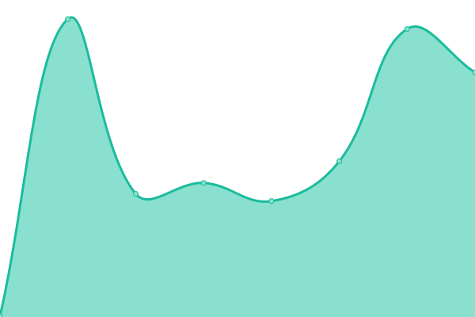

# [📈 Live Status](https://upptime.fediverses.kr): <!--live status--> **🟧 Partial outage**

This repository contains the open-source uptime monitor and status page for [fediverses-kr](https://upptime.fediverses.kr), powered by [Upptime](https://github.com/upptime/upptime).

With [Upptime](https://upptime.js.org), you can get your own unlimited and free uptime monitor and status page, powered entirely by a GitHub repository. We use [Issues](https://github.com/fediverses-kr/upptime/issues) as incident reports, [Actions](https://github.com/fediverses-kr/upptime/actions) as uptime monitors, and [Pages](https://upptime.fediverses.kr) for the status page.

<!--start: status pages-->
<!-- This summary is generated by Upptime (https://github.com/upptime/upptime) -->
<!-- Do not edit this manually, your changes will be overwritten -->
<!-- prettier-ignore -->
| URL | Status | History | Response Time | Uptime |
| --- | ------ | ------- | ------------- | ------ |
|  [Bluesky (AtProto)](https://bsky.app/) | 🟩 Up | [bluesky-at-proto.yml](https://github.com/fediverses-kr/upptime/commits/HEAD/history/bluesky-at-proto.yml) | 

 236ms
     
 | 

<a href="https://upptime.fediverses.kr/history/bluesky-at-proto">100.00%</a>
    

|  [Bridgy Fed](https://fed.brid.gy/) | 🟩 Up | [bridgy-fed.yml](https://github.com/fediverses-kr/upptime/commits/HEAD/history/bridgy-fed.yml) | 

 199ms
     
 | 

<a href="https://upptime.fediverses.kr/history/bridgy-fed">100.00%</a>
    

|  [플래닛](https://planet.moe/) | 🟩 Up | [planet.moe.yml](https://github.com/fediverses-kr/upptime/commits/HEAD/history/planet.moe.yml) | 

 1042ms
     
 | 

<a href="https://upptime.fediverses.kr/history/planet.moe">100.00%</a>
    

|  [큐돈](https://qdon.space/) | 🟩 Up | [qdon.space.yml](https://github.com/fediverses-kr/upptime/commits/HEAD/history/qdon.space.yml) | 

 613ms
     
 | 

<a href="https://upptime.fediverses.kr/history/qdon.space">100.00%</a>
    

|  [즘](https://jmm.kr/) | 🟩 Up | [jmm.kr.yml](https://github.com/fediverses-kr/upptime/commits/HEAD/history/jmm.kr.yml) | 

 857ms
     
 | 

<a href="https://upptime.fediverses.kr/history/jmm.kr">100.00%</a>
    

|  [유루툿](https://toot.funami.tech/) | 🟩 Up | [toot.funami.tech.yml](https://github.com/fediverses-kr/upptime/commits/HEAD/history/toot.funami.tech.yml) | 

 966ms
     
 | 

<a href="https://upptime.fediverses.kr/history/toot.funami.tech">100.00%</a>
    

|  [우리인생](https://uri.life/) | 🟩 Up | [uri.life.yml](https://github.com/fediverses-kr/upptime/commits/HEAD/history/uri.life.yml) | 

 543ms
     
 | 

<a href="https://upptime.fediverses.kr/history/uri.life">100.00%</a>
    

|  [마라탕.인생](https://maratang.life/) | 🟩 Up | [maratang.life.yml](https://github.com/fediverses-kr/upptime/commits/HEAD/history/maratang.life.yml) | 

 686ms
     
 | 

<a href="https://upptime.fediverses.kr/history/maratang.life">100.00%</a>
    

|  [커리](https://kurry.social/) | 🟩 Up | [kurry.social.yml](https://github.com/fediverses-kr/upptime/commits/HEAD/history/kurry.social.yml) | 

 636ms
     
 | 

<a href="https://upptime.fediverses.kr/history/kurry.social">100.00%</a>
    

|  [자커마스](https://occm.cc/) | 🟩 Up | [occm.cc.yml](https://github.com/fediverses-kr/upptime/commits/HEAD/history/occm.cc.yml) | 

 649ms
     
 | 

<a href="https://upptime.fediverses.kr/history/occm.cc">100.00%</a>
    

|  [포인트리스](https://pointless.chat/) | 🟩 Up | [pointless.chat.yml](https://github.com/fediverses-kr/upptime/commits/HEAD/history/pointless.chat.yml) | 

 294ms
     
 | 

<a href="https://upptime.fediverses.kr/history/pointless.chat">100.00%</a>
    

|  [무리 네트워크](https://muri.network/) | 🟩 Up | [muri.network.yml](https://github.com/fediverses-kr/upptime/commits/HEAD/history/muri.network.yml) | 

 1116ms
     
 | 

<a href="https://upptime.fediverses.kr/history/muri.network">98.31%</a>
    

|  [넷스피어 원](https://netsphere.one/) | 🟩 Up | [netsphere.one.yml](https://github.com/fediverses-kr/upptime/commits/HEAD/history/netsphere.one.yml) | 

 827ms
     
 | 

<a href="https://upptime.fediverses.kr/history/netsphere.one">98.31%</a>
    

|  [엠네트워크 마스토돈](https://mastodon.mnetwork.co.kr/) | 🟩 Up | [mastodon.mnetwork.co.kr.yml](https://github.com/fediverses-kr/upptime/commits/HEAD/history/mastodon.mnetwork.co.kr.yml) | 

 755ms
     
 | 

<a href="https://upptime.fediverses.kr/history/mastodon.mnetwork.co.kr">100.00%</a>
    

|  [머스타드](https://mustard.blog/) | 🟩 Up | [mustard.blog.yml](https://github.com/fediverses-kr/upptime/commits/HEAD/history/mustard.blog.yml) | 

 787ms
     
 | 

<a href="https://upptime.fediverses.kr/history/mustard.blog">100.00%</a>
    

|  [차돌이](https://t.chadole.com/) | 🟩 Up | [t.chadole.com.yml](https://github.com/fediverses-kr/upptime/commits/HEAD/history/t.chadole.com.yml) | 

 1009ms
     
 | 

<a href="https://upptime.fediverses.kr/history/t.chadole.com">100.00%</a>
    

|  [알피지 주점](https://krpgpub.net/) | 🟩 Up | [krpgpub.net.yml](https://github.com/fediverses-kr/upptime/commits/HEAD/history/krpgpub.net.yml) | 

 712ms
     
 | 

<a href="https://upptime.fediverses.kr/history/krpgpub.net">100.00%</a>
    

|  [슈퍼마-켙](https://bakedbean.xyz/) | 🟩 Up | [bakedbean.xyz.yml](https://github.com/fediverses-kr/upptime/commits/HEAD/history/bakedbean.xyz.yml) | 

 1053ms
     
 | 

<a href="https://upptime.fediverses.kr/history/bakedbean.xyz">100.00%</a>
    

|  [콘오.펍](https://kono.pub/) | 🟩 Up | [kono.pub.yml](https://github.com/fediverses-kr/upptime/commits/HEAD/history/kono.pub.yml) | 

 655ms
     
 | 

<a href="https://upptime.fediverses.kr/history/kono.pub">100.00%</a>
    

|  [티알피지](https://trpg-o.xyz/) | 🟩 Up | [trpg-o.xyz.yml](https://github.com/fediverses-kr/upptime/commits/HEAD/history/trpg-o.xyz.yml) | 

 651ms
     
 | 

<a href="https://upptime.fediverses.kr/history/trpg-o.xyz">100.00%</a>
    

|  [S'More](https://s.mysw.moe/) | 🟩 Up | [s-more.yml](https://github.com/fediverses-kr/upptime/commits/HEAD/history/s-more.yml) | 

 1135ms
     
 | 

<a href="https://upptime.fediverses.kr/history/s-more">99.70%</a>
    

|  [캐츠워즈 콜로세움](https://catswords.social/) | 🟩 Up | [catswords.social.yml](https://github.com/fediverses-kr/upptime/commits/HEAD/history/catswords.social.yml) | 

 783ms
     
 | 

<a href="https://upptime.fediverses.kr/history/catswords.social">100.00%</a>
    

|  [페일 블루 보이저](https://town.voyager.blue/) | 🟩 Up | [town.voyager.blue.yml](https://github.com/fediverses-kr/upptime/commits/HEAD/history/town.voyager.blue.yml) | 

 671ms
     
 | 

<a href="https://upptime.fediverses.kr/history/town.voyager.blue">100.00%</a>
    

|  [덕스페이스](https://duk.space/) | 🟩 Up | [duk.space.yml](https://github.com/fediverses-kr/upptime/commits/HEAD/history/duk.space.yml) | 

 720ms
     
 | 

<a href="https://upptime.fediverses.kr/history/duk.space">100.00%</a>
    

|  [미스키한국](https://misskey.kr/) | 🟥 Down | [misskey.kr.yml](https://github.com/fediverses-kr/upptime/commits/HEAD/history/misskey.kr.yml) | 

 701ms
     
 | 

<a href="https://upptime.fediverses.kr/history/misskey.kr">70.46%</a>
    

|  [키라링](https://k.lapy.link/) | 🟩 Up | [k.lapy.link.yml](https://github.com/fediverses-kr/upptime/commits/HEAD/history/k.lapy.link.yml) | 

 613ms
     
 | 

<a href="https://upptime.fediverses.kr/history/k.lapy.link">100.00%</a>
    

|  [버터스콘](https://buttersc.one/) | 🟩 Up | [buttersc.one.yml](https://github.com/fediverses-kr/upptime/commits/HEAD/history/buttersc.one.yml) | 

 934ms
     
 | 

<a href="https://upptime.fediverses.kr/history/buttersc.one">100.00%</a>
    

|  [맛소스통](https://masost.one/) | 🟩 Up | [masost.one.yml](https://github.com/fediverses-kr/upptime/commits/HEAD/history/masost.one.yml) | 

 267ms
     
 | 

<a href="https://upptime.fediverses.kr/history/masost.one">99.93%</a>
    

|  [호토모에](https://hoto.moe/) | 🟩 Up | [hoto.moe.yml](https://github.com/fediverses-kr/upptime/commits/HEAD/history/hoto.moe.yml) | 

 841ms
     
 | 

<a href="https://upptime.fediverses.kr/history/hoto.moe">99.91%</a>
    

|  [코코넥트](https://kokonect.link/) | 🟩 Up | [kokonect.link.yml](https://github.com/fediverses-kr/upptime/commits/HEAD/history/kokonect.link.yml) | 

 810ms
     
 | 

<a href="https://upptime.fediverses.kr/history/kokonect.link">100.00%</a>
    

|  [고양이별](https://nekoplanet.xyz/) | 🟩 Up | [nekoplanet.xyz.yml](https://github.com/fediverses-kr/upptime/commits/HEAD/history/nekoplanet.xyz.yml) | 

 316ms
     
 | 

<a href="https://upptime.fediverses.kr/history/nekoplanet.xyz">100.00%</a>
    

|  [대피소](https://daepi.so/) | 🟩 Up | [daepi.so.yml](https://github.com/fediverses-kr/upptime/commits/HEAD/history/daepi.so.yml) | 

 1140ms
     
 | 

<a href="https://upptime.fediverses.kr/history/daepi.so">99.37%</a>
    

|  [요단강 익스프레스](https://yodangang.express/) | 🟩 Up | [yodangang.express.yml](https://github.com/fediverses-kr/upptime/commits/HEAD/history/yodangang.express.yml) | 

 1128ms
     
 | 

<a href="https://upptime.fediverses.kr/history/yodangang.express">97.11%</a>
    

<!--end: status pages-->

[**Visit our status website →**](https://upptime.fediverses.kr)

## 📄 License

- Powered by: [Upptime](https://github.com/upptime/upptime)
- Code: [MIT](./LICENSE) © [Anand Chowdhary](https://anandchowdhary.com), supported by [Pabio](https://pabio.com)
- Data in the `./history` directory: [Open Database License](https://opendatacommons.org/licenses/odbl/1-0/)
